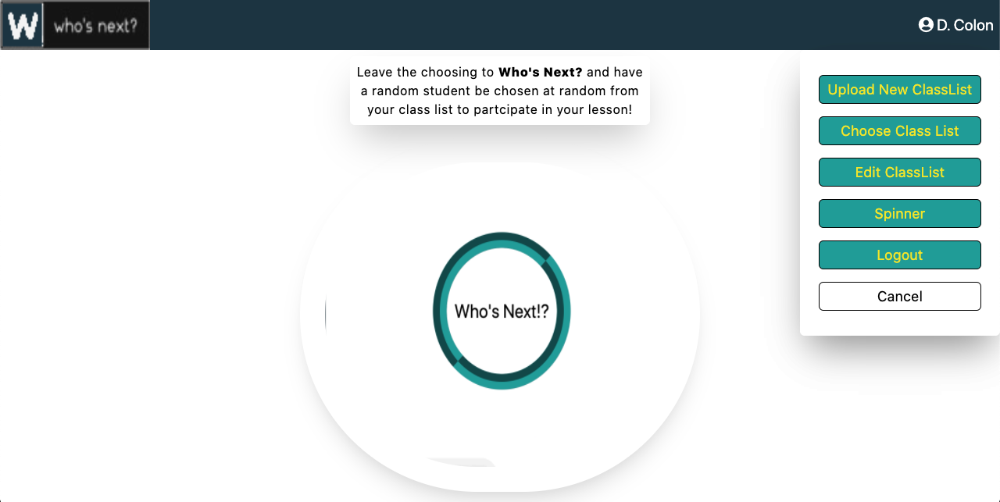
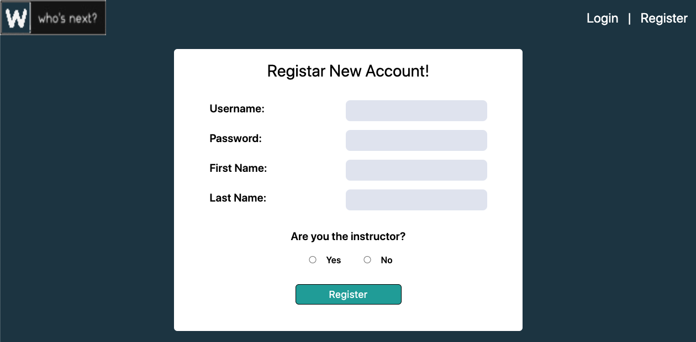
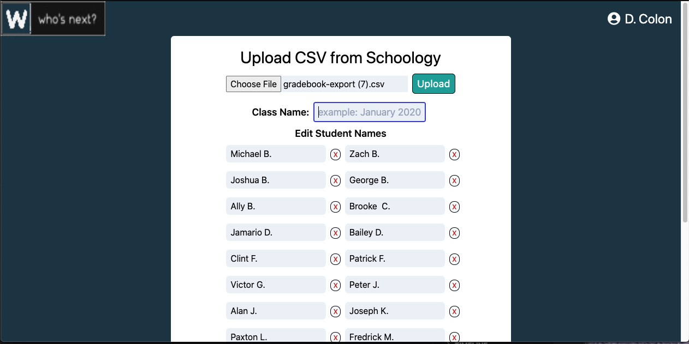
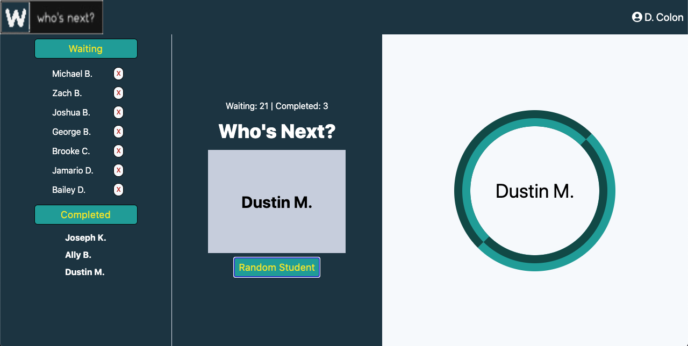

### Who's Next?

[Who's Next](http://whosnext.netlify.com)

## Description
A Random name generator that picks a name at random from a class list. The Lastest update allows for Instructor or DIRs to upload a CSV exported from Schoology, and generate a class list from it.

## Motavation
Our instructor had used a simple random name picker. I wanted to make one that prevented duplicate names and allow the instructor to 'pick' a student if he/she so choose too. It has evolved to include a ExpressJS backend that can store multiple class lists from other instructors.

## Screenshots

### Login or sign up!

### Register a new account!

### Upload a new class list from schoology!

### Add some suspense when choosing names when picking a new name!

## Features
Randomly picks a student from the list
Upload and parse CSV from Schoology for ease of use!
Animation added for suspense!

## Tech Used

### Client-side

 - Reactjs
 - Formik
 - Yup
 - classnames
 - Cypress
 - TailwindCSS

### Server-side

 - ExpressJS
 - pg-promise
 - Heroku PostgreSQL
 - Heroku CLI
 - PassportJS

