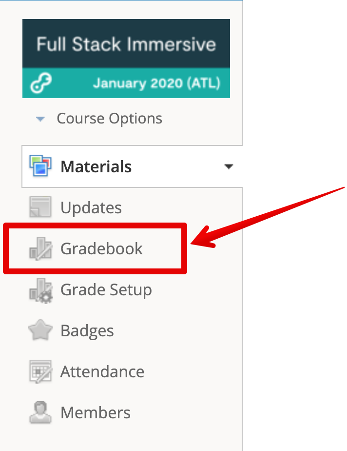
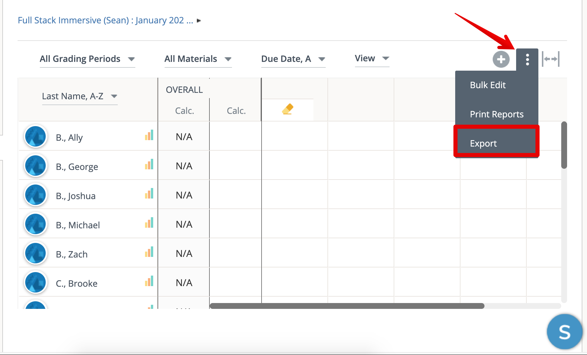
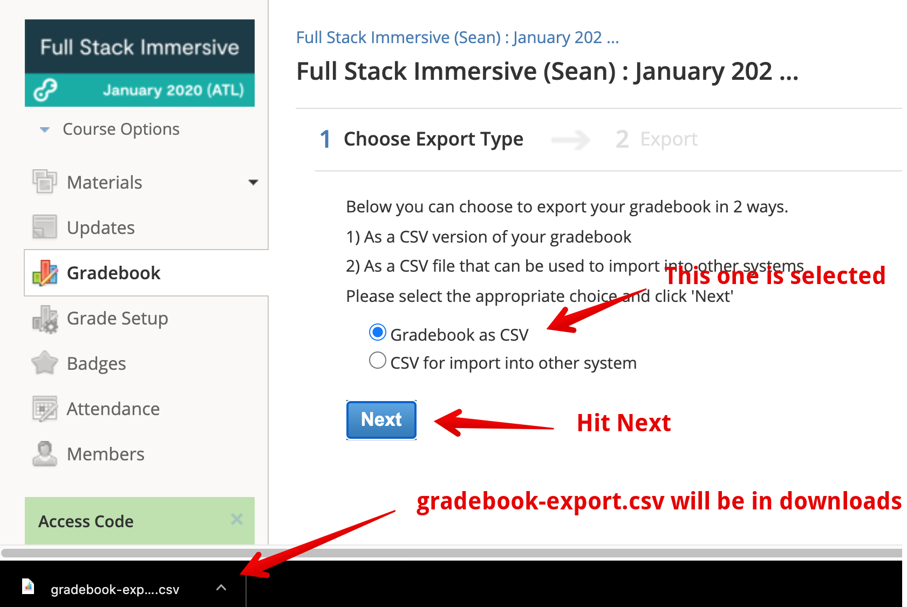
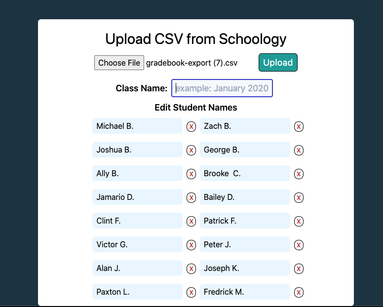

# Whos Next?

## Walkthrough instructions for exporting and uploading CSV from schoology

### ON SCHOOLOGY

Thanks for using Who's Next! Let's walk through a few steps to upload your first class list!

First register or log in to your account @ [whosnext.netlify.app](https://whosnext.netlify.app).

We will then need to navigate to your [Schoology account](https://app.schoology.com/) as a DIR or instructor.

Click on 'Gradebook' 

On the gradebook screen you'll want to click on the veritical ellipsis on the top right. Then click on export.

Here you should be given options on how you want to export the gradebook. Make sure to click on the option for 'Gradebook as CSV' then click 'Next'. You should see that the file has been downloaded into your downloads folder.

### ON WHO'S NEXT

Return to [whosnext.netlify.app](https://whosnext.netlify.app). In the account Menu (if you are logged in click on your name on the top right). Click the button for upload new class list. This form is pretty straight forward. Click the button to choose the `gradebook-export.csv' you just downloaded. And it generate a class list from the information in the file. 

Create a name for the class.

You can also add/remove and edit the names in the list and then click save to save it to the datebase and as your default class list.

Once your class has been added your DIR and/or instructor may also use the same list by going to the account menu once they sign up and clicking on 'Choose Class List' and then finding the name of the class you uploaded.

Your now ready to go just go to the account menu again and head to the Spinner you'll see in the waiting list that you class has been loaded and is ready for use!

